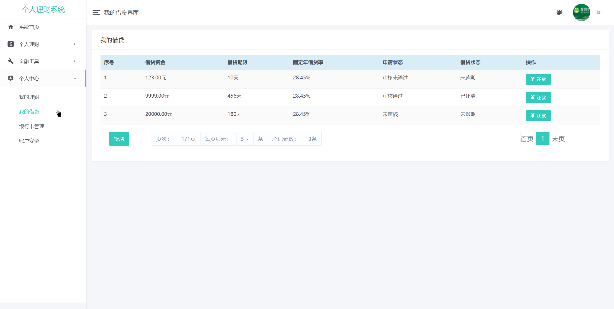
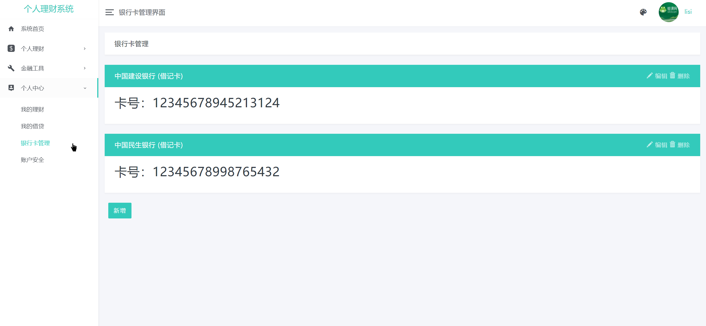
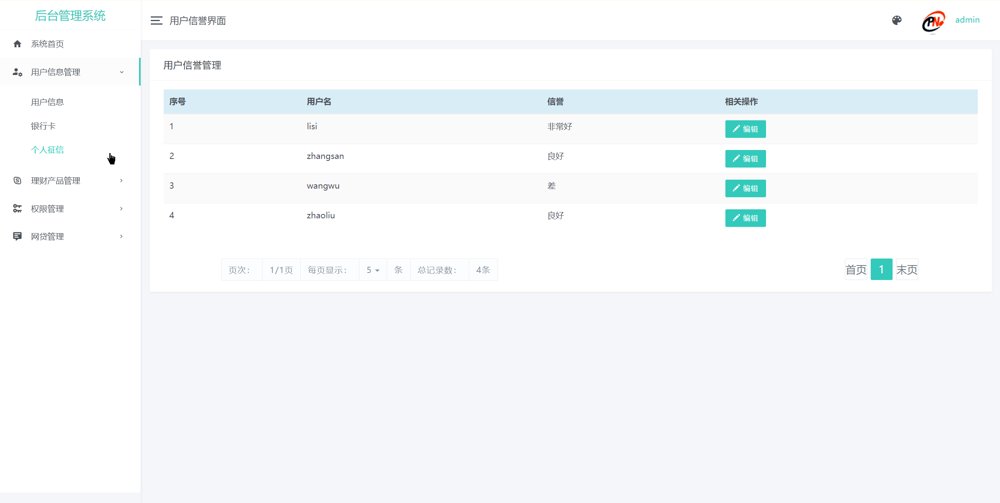
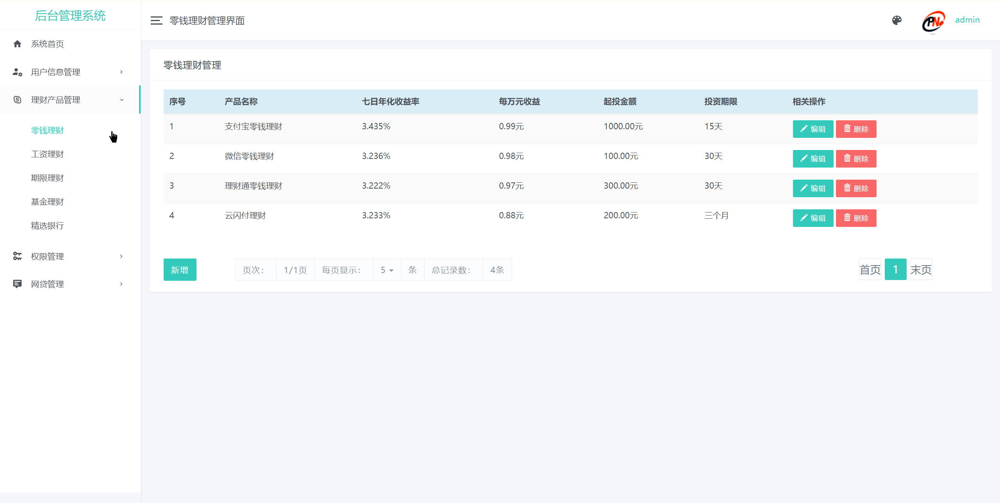
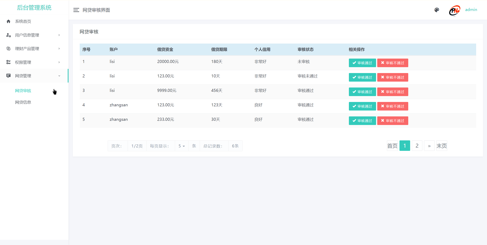
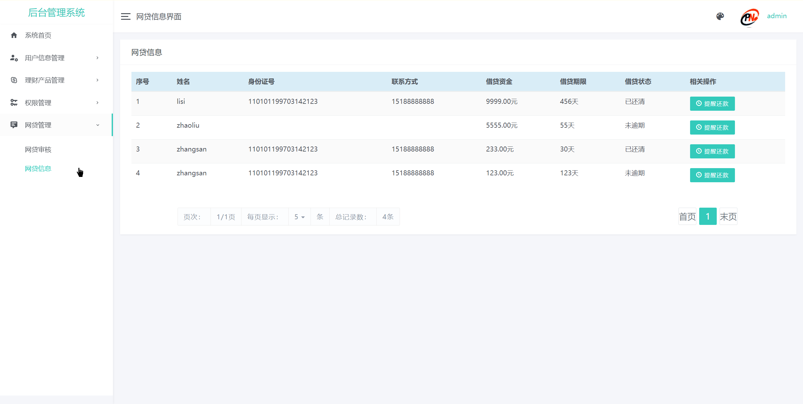
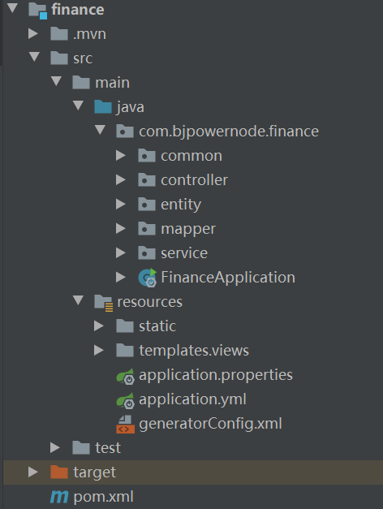

## 基于SpringBoot的个人理财系统

- <b>完整代码获取地址：从戎源码网 ([https://armycodes.com/](https://armycodes.com/))</b>
- <b>技术探讨、资料分享，请加QQ群：692619798</b> 
- <b>作者微信：19941326836  QQ：952045282</b> 
- <b>承接计算机毕业设计、Java毕业设计、Python毕业设计、深度学习、机器学习</b>
- <b>选题+开题报告+任务书+程序定制+安装调试+论文+答辩ppt 一条龙服务</b>
- <b>所有选题地址 ([https://github.com/YuLin-Coder/AllProjectCatalog](https://github.com/YuLin-Coder/AllProjectCatalog)) </b>

## 项目介绍
基于SpringBoot的个人理财系统，有用户和管理员两个角色，
普通用户： 个人理财、金融工具、个人中心。 
管理员： 用户信息管理、理财产品管理、权限管理、网贷管理。

### 【管理员】:
用户信息管理：用户信息、银行卡、个人征信；
理财产品管理：零钱理财、工资理财、期限理财、基金理财、精选银行；
权限管理：用户权限、管理员权限；
网贷管理：网贷审核、网贷信息。

### 【普通用户】:
个人理财：零钱理财、工资理财、期限理财、基金理财、银行推荐；
金融工具：资金记录、安全网贷；
个人中心：我的理财、我的借贷i、银行卡管理、账户安全;

## 项目技术
- 编程语言：Java
- 数据库：MySQL
- 项目管理工具：Maven
- 前端技术：Thymeleaf 、JavaScript、Bootstrap
- 后端技术：SpringBoot

## 运行环境
- JDK版本：JDK1.8及以上
- 开发工具：IDEA、Ecplise、Myecplise都可以
- 数据库: MySQL5.7及以上
- Maven：maven3.0及以上

## 运行截图

